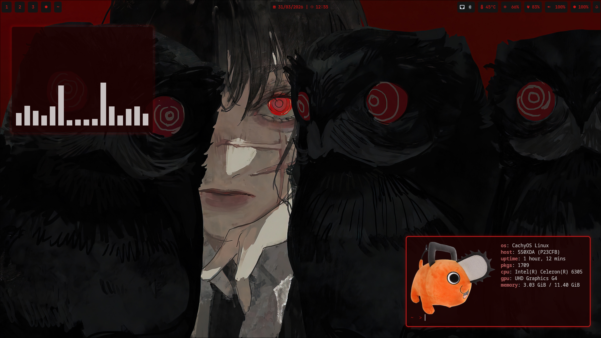

#                  This is My Config :D
<p align="center">
  
</p>

> [!CAUTION]
> I'm new to programming, so I don't come to say that this command is 100% stable, maybe it may not work, especially if you don't use arch or arch-based distro (you need to have an arch distro)

# Installation

> You will first need to clone the repository and access 
```bash
git clone https://github.com/dipcarioca/dotfiles.git
cd dotfiles
```

> Soon after, you will give the installer runtime permission
```bash
chmod +x install.sh
```

> Just you now use the executable and good luck <3 (if any problem, report and apologize for the Inconvenience)
```bash
./install.sh 
```


# What will you install for Dotfiles

## Personal Use
- **Firefox** – web browser  
- **Code** – code editor  
- **MPV** – media player  
- **Flameshot** – screenshots  
- **Fastfetch** – system info

## Apperance
- **Wallpaper**: Yoru - Chainsaw Man
- **Pywal** – generates color schemes from wallpaper  
- **Colorz** – color extraction backend
- **Theme** - [Flat Remix GTK (Red)](https://github.com/daniruiz/Flat-Remix-GTK)
- **Cursor** - [Breeze Dark Red Cursor](https://store.kde.org/p/2108645)
- **Icons** - [Nordzy Icons (Red Dark)](https://github.com/MolassesLover/Nordzy-icon)

## Hyprland ecosystem 

- **Hyprland** – dynamic tiling Wayland compositor  
- **Hyprlock** – lock screen  
- **Hyprpaper** – wallpaper manager  
- **Hyprsunset** – blue light filter (yes.) 
- **Hyprshot** –  screenshot utility 

## Hyprland Utilities
- **Waybar** – customizable status bar  
- **Rofi** – application launcher  
- **Kitty** – GPU-accelerated terminal  
- **SwayNC** – notification center  
- **Brightnessctl** – brightness control  
- **Playerctl** – media control  
- **Nwg-look** – GTK settings manager  
- **Nwg-dock-hyprland** – dock for Hyprland

## System Tools
- **Dolphin** – file manager  
- **Ark** – archive manager  
- **Pavucontrol** – audio control  
- **Blueman** – Bluetooth manager  
- **Polkit KDE Agent** – authentication dialogs  
- **UFW** – firewall  
- **NetworkManager** – network handling  
- **SDDM** – display/login manager  

